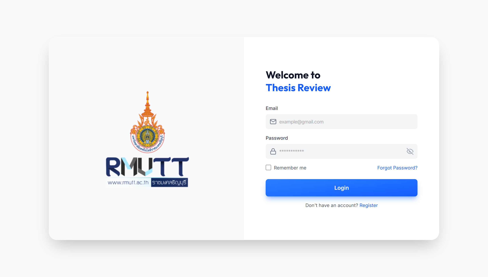
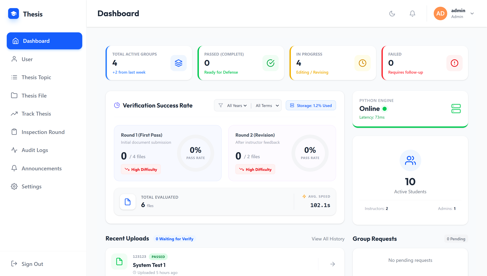
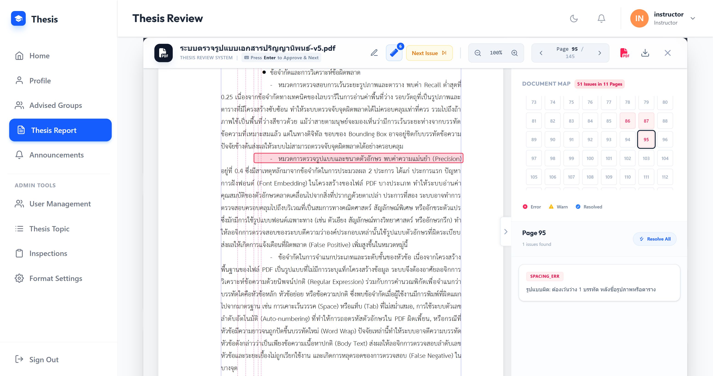
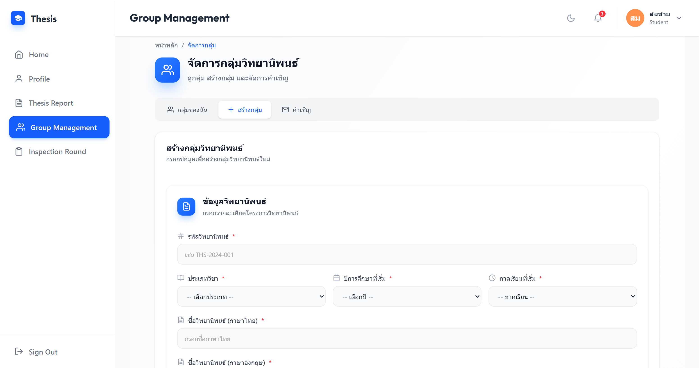
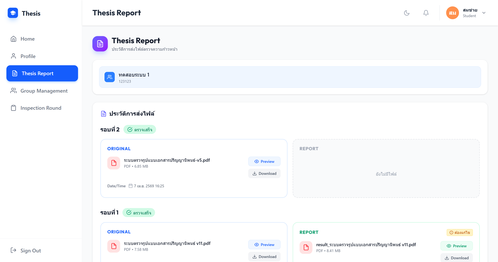

# 📚 VUTF Web - Thesis Management System


A modern, full-featured thesis management and review system built with React and TypeScript. Provides role-based workflows for students, instructors, and administrators to manage thesis submissions, group collaborations, inspections, and academic reporting.

    

---

## 🚀 Quick Start

### Prerequisites
- **Node.js** 18+ and **npm** or **yarn**
- Backend API running on `http://localhost:3000` (for development)

### Installation & Running

```bash
# Clone and navigate
cd vutf-web

# Install dependencies
npm install

# Start development server
npm run dev
```

The dev server starts at `http://localhost:5173` by default and proxies API requests to `http://localhost:3000`.

> **Note:** Ensure your backend API is running before starting the frontend dev server.

### Environment Variables

Create a `.env` file in the root directory (optional):

```env
VITE_API_URL=http://localhost:3000/
```

If not set, the app defaults to `/api/v1` and proxies to the backend during development.

---

## ✨ Features

### 👨‍🎓 Student Features
- ✅ Create and manage thesis groups
- ✅ Send/receive group invitations
- ✅ Upload thesis files for inspection rounds
- ✅ Track submission and inspection status
- ✅ View advisor and instructor feedback
- ✅ Download generated thesis reports
- ✅ Profile management and personal settings

### 👨‍🏫 Instructor Features
- ✅ Dashboard with thesis statistics and insights
- ✅ Manage advised thesis groups and members
- ✅ Review and comment on student submissions
- ✅ Generate and verify thesis reports
- ✅ Track thesis progress with visual charts
- ✅ Manage inspection rounds
- ✅ Access audit logs and system notifications

### 👨‍💼 Admin Features
- ✅ System-wide dashboard and analytics
- ✅ User management (create, edit, lock/unlock accounts)
- ✅ Inspection round management (create, open, close)
- ✅ Thesis topic and file management
- ✅ Comprehensive audit logging
- ✅ System settings and configuration
- ✅ Track thesis groups across the institution

### 🌐 Common Features
- ✅ **Real-time Notifications** via WebSocket (Socket.io)
- ✅ **Role-Based Access Control (RBAC)** for secure workflows
- ✅ **Dark Mode** support with theme toggle
- ✅ **Responsive Design** optimized for mobile and desktop
- ✅ **Multi-language Support** (Thai/English)
- ✅ **PDF Viewing & Export** for document management
- ✅ **CSV Import/Export** for data management
- ✅ **Form Validation** with Zod and React Hook Form
- ✅ **Announcement System** for institution-wide messaging

---

## 🛠️ Tech Stack

### **Frontend Framework**
- **React** 18.2.0 - UI library with modern hooks and concurrent rendering
- **TypeScript** 5.2.2 - Type safety and enhanced developer experience
- **Vite** 5.0.0 - Lightning-fast build tool with HMR

### **Styling & UI Components**
- **Tailwind CSS** 4.1.17 - Utility-first CSS framework
- **Lucide React** 0.292.0 - Lightweight icon library
- **Heroicons** 2.2.0 - Beautiful SVG icons
- **React Icons** 5.5.0 - Popular icon sets
- **Font Awesome** 7.1.0 - Comprehensive icon library
- **Framer Motion** 10.16.4 - Smooth animations and transitions
- **SweetAlert2** 11.26.3 - Beautiful alert dialogs
- **React Hot Toast** 2.6.0 - Lightweight notifications

### **Forms & Data Validation**
- **React Hook Form** 7.67.0 - Performant form state management
- **@hookform/resolvers** 5.2.2 - Validation schema adapters
- **Zod** 4.1.13 - TypeScript-first schema validation

### **State & Communication**
- **React Context API** - Global state management (auth, notifications)
- **Socket.io-client** 4.8.3 - Real-time bidirectional communication
- **React Router DOM** 7.9.6 - Client-side routing

### **Data & Document Handling**
- **PDF-lib** 1.17.1 - PDF manipulation and generation
- **React-pdf** 10.3.0 - PDF document viewer
- **Papaparse** 5.5.3 - CSV data parsing and export
- **date-fns** 4.1.0 - Modern date utility library
- **React DatePicker** 9.1.0 - Accessible date picker component

### **Data Visualization**
- **Recharts** 3.7.0 - Composable charting library

### **Development Tools**
- **ESLint** 8.53.0 - Code quality and style enforcement
- **Autoprefixer** 10.4.22 - CSS vendor prefix support
- **PostCSS** 8.5.6 - CSS transformation tool

---

## 🔗 API Integration

The frontend communicates with the backend via a RESTful API:

### API Base URL
- **Development:** `http://localhost:3000/api/v1` (proxied by Vite)
- **Custom:** Set `VITE_API_URL` environment variable for tunnels or custom deployments

### Key API Features
- **Cookie-based Authentication:** HTTP-only cookies set by backend for session management
- **Token Refresh:** Automatic retry with refresh token for concurrent requests
- **CORS with Credentials:** Credentials included in all API requests
- **Response Wrapper:** Consistent `ApiResponse<T>` format for all endpoints

### Real-time Communication
- **WebSocket (Socket.io):** Bi-directional communication for live notifications
- **Features:** Live notifications, automatic reconnection (5 attempts), unread count tracking
- **Proxy:** `/socket.io` proxied to backend during development

See `src/services/api.ts` for client configuration details.

---

## 📦 Available Scripts

### Development
```bash
npm run dev
```
Starts the Vite dev server with hot module replacement (HMR) at `http://localhost:5173`.

### Build Production
```bash
npm run build
```
Runs TypeScript type checking followed by optimized Vite build output to `dist/`.

### Linting
```bash
npm run lint
```
Checks code quality with ESLint. Enforces strict rule set with no unused variables or directives allowed.

### Preview Build
```bash
npm run preview
```
Previews the production build locally before deployment.

---

## 🎨 Screenshots 

### Login


### Admin Dashboard


### Instructor Thesis Review


### Student Group Management


### Student Report


---

## 📚 Key Dependencies & Their Roles

| Package | Version | Purpose |
|---------|---------|---------|
| react | 18.2.0 | UI library |
| typescript | 5.2.2 | Type safety |
| vite | 5.0.0 | Build tool |
| tailwindcss | 4.1.17 | Styling |
| react-hook-form | 7.67.0 | Form state |
| zod | 4.1.13 | Schema validation |
| socket.io-client | 4.8.3 | Real-time communication |
| react-router-dom | 7.9.6 | Routing |
| sweetalert2 | 11.26.3 | Alert dialogs |
| recharts | 3.7.0 | Data visualization |
| date-fns | 4.1.0 | Date utilities |
| pdf-lib | 1.17.1 | PDF generation |
